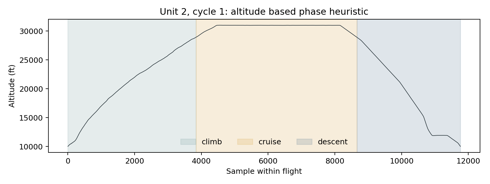
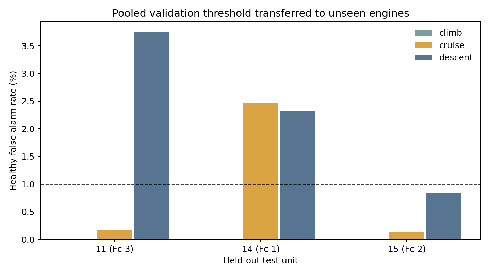
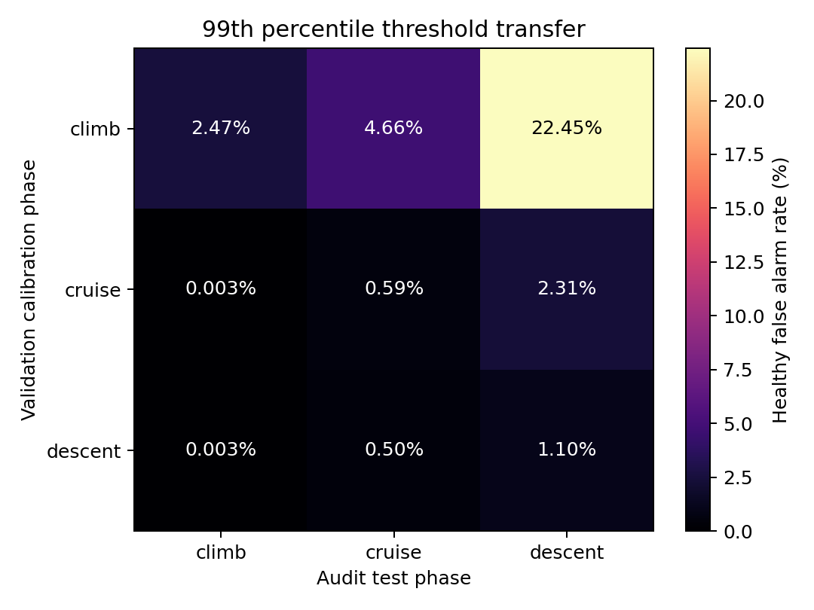
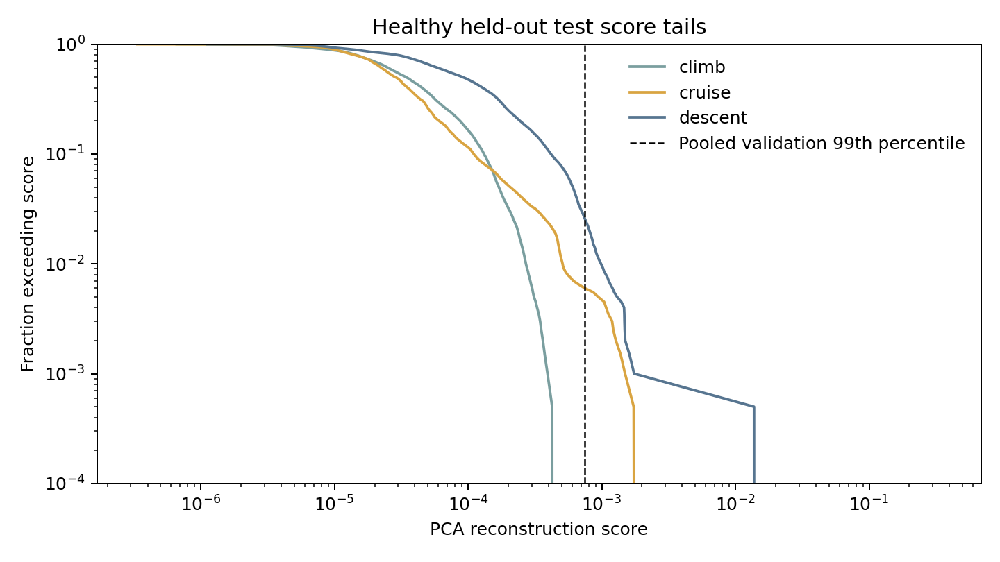

# DS02 healthy PCA phase-calibration pilot

## Purpose and decision

This pilot tries to falsify the proposed phase-entanglement mechanism with a small, fixed PCA detector. The screening result is **GO for further investigation**, not a confirmation of the mechanism. A pooled threshold calibrated for a nominal 1% healthy false alarm rate produced phase-dependent rates on all three unseen engines. No phase exceeded 5% under that pooled threshold. A threshold calibrated on validation **climb** alone exceeded 5% when transferred to audit descent. Score-only phase prediction reached 45.0% balanced accuracy versus 33.3% three-class chance. These are descriptive screening results, not significance tests.

## Source and verified schema

The requested path under `D:\Datasets\N-CMAPSS` was empty. The DS02 HDF5 file now resides at `N-CMAPSS/N-CMAPSS_DS02-006.h5`. It was downloaded from the [Figshare DS02 research copy](https://doi.org/10.6084/m9.figshare.20436504.v1), with MD5 `61056251b36290e11371e017eed70eac`, matching the Figshare record. I then downloaded the [NASA PCoE](https://www.nasa.gov/intelligent-systems-division/discovery-and-systems-health/pcoe/pcoe-data-set-repository/) full archive and verified that its DS02 member has the same byte length and MD5. Thus the project file is byte-for-byte identical to the official file. `N-CMAPSS/source.json` and `N-CMAPSS/official_verification.json` record this provenance. The large temporary NASA archives were removed after verification.

I opened the HDF5 before writing the analysis. It has 5,263,447 development rows and 1,253,743 official test rows. Its variable arrays contain:

| HDF5 group | Verified columns | Use |
|---|---|---|
| `A_*` | `unit`, `cycle`, `Fc`, `hs` | Unit split, flight grouping, audit class, healthy filter only |
| `W_*` | `alt`, `Mach`, `TRA`, `T2` | `alt` for retrospective phase labels only |
| `X_s_*` | `T24`, `T30`, `T48`, `T50`, `P15`, `P2`, `P21`, `P24`, `Ps30`, `P40`, `P50`, `Nf`, `Nc`, `Wf` | Detector inputs |
| `X_v_*` | 14 virtual sensors | Excluded |
| `T_*` | 10 health parameters | Excluded |
| `Y_*` | RUL | Excluded |

`hs` takes values 0 and 1. Each unit starts with `hs=1` and transitions at most once to 0; all healthy flight cycles are complete rather than partly degraded. The [dataset description by its creators](https://www.mdpi.com/2306-5729/6/1/5) identifies 1 as healthy. Only `hs=1` rows enter fitting, calibration, and audit. `hs`, `Fc`, `unit`, `cycle`, all `W` variables, RUL, virtual sensors, and health parameters are absent from PCA input.

## Fixed method

- **Unit split:** development units 2, 5, 10, 16 for training; development units 18, 20 for validation and threshold calibration; official test units 11, 14, 15 for audit. No timestamp or flight is shared across those groups. Healthy counts are 760,082 training, 386,643 validation, and 433,113 test rows.
- **Phase heuristic:** the HDF5 provides flight class `Fc`, not within-flight phase. For each `(unit, cycle)` altitude trace, set the high-altitude boundary at `minimum altitude + 0.90 × (maximum − minimum)`. Label rows before the first crossing as **climb**, rows from first through last crossing as **cruise**, and rows afterward as **descent**. All 648 flights have nonempty segments. These names describe the altitude-based heuristic over the recorded flight segment, which starts and ends near 10,000 ft; they are not supplied labels. The full flight trace is used only for retrospective phase evaluation, never as detector input.
- **Detector:** fit `StandardScaler` and 5-component PCA on healthy training-unit measured sensors only, retaining the source HDF5's float64 precision. Score each row by mean squared standardized reconstruction error. Five components were fixed for this pilot, with no test tuning. The first five PCs explain 99.9916% of training standardized variance.
- **Calibration:** the pooled 99th percentile of all healthy validation scores, using the empirical `higher` quantile, is `0.000746884066`. Alarm on `score > threshold`. Each row counts once, so rates are time-weighted and serially dependent. The nominal 1% describes validation calibration, not a guarantee on new engines or phases.
- **Score-only probe:** a depth-3, class-balanced decision tree on `log10(score)` was fitted to the two validation engines' heuristic phase labels and evaluated only on official test engines. It receives no sensors or flight variables directly.

## Main audit result

Healthy false alarm rates on official held-out units under the **pooled** validation threshold:

| Test unit (flight class) | Climb | Cruise | Descent |
|---|---:|---:|---:|
| 11 (3, same as development) | 0.0037% (2/53,678) | 0.170% (147/86,535) | **3.75%** (2,742/73,093) |
| 14 (1) | 0.0082% (1/12,241) | **2.46%** (822/33,377) | 2.33% (621/26,650) |
| 15 (2) | 0.0020% (1/48,789) | 0.135% (72/53,466) | **0.837%** (379/45,284) |
| All test rows | 0.0035% (4/114,708) | 0.600% (1,041/173,378) | 2.58% (3,742/145,027) |

The largest-to-smallest phase rate exceeds 3× in each held-out engine, although comparisons to the nearly zero climb rates are unstable. A stronger within-engine contrast is unit 11: descent is 22.1× cruise and appears on the test engine with the same flight class as development. Descent alarms occur in all 18 healthy flights of unit 11; 9 of those 18 flights exceed 1% descent alarms. Other aggregate rates can be concentrated in fewer flights: unit 14 cruise alarms appear in 5 of 35 healthy flights. See `results/phase_flight_audit.csv`.

## Threshold transfer and phase information in scores

Rows below use a separate validation 99th-percentile threshold for the stated calibration phase; columns are the healthy official-test false alarm rates. This is a **calibration-phase × test-phase** transfer audit, pooled across test engines:

| Validation calibration phase (threshold) | Test climb | Test cruise | Test descent |
|---|---:|---:|---:|
| Climb (`0.00022086`) | 2.47% | 4.66% | **22.45%** |
| Cruise (`0.00077513`) | 0.0035% | 0.588% | 2.31% |
| Descent (`0.00095070`) | 0.0026% | 0.496% | 1.10% |

The climb-calibrated threshold also yields 20.09% on unit 11 descent, so the strong transfer failure is visible within the shared flight class. These phase-specific thresholds are diagnostic transfer experiments, not a proposed deployed policy.

The score-only phase probe achieved 45.0% balanced accuracy pooled across test rows, with 43.3% on same-class unit 11, 49.3% on unit 14, and 45.0% on unit 15; three-class chance is 33.3%. Recall is uneven, so the score contains some phase information but is far from a reliable phase classifier. The healthy test score tails differ by phase:

## Interpretation and limits

The pilot meets the repeated ≥3× disparity screen and the score-only prediction screen. The pooled 1% threshold does **not** meet the >5% screen; the climb-specific 1% threshold exceeds 5% when transferred to descent. These observations warrant another controlled experiment. They do not establish that phase variation *causes* the false alarms: altitude, Mach, throttle, temperature, flight duration, and engine differences co-vary. The phase definition is a heuristic, and its 90% boundary has not been stress-tested here.

The development units are all `Fc=3`. Official test unit 11 is also `Fc=3`, while units 14 and 15 are `Fc=1` and `Fc=2`, respectively. Their phase and class shifts cannot be separated with this split. There are only three held-out engines, and adjacent rows are highly correlated; large row counts should not be read as thousands of independent replications. This GO decision is for follow-up work, not a claim of novelty or publication readiness. No LSTM or other complex model was implemented.

## Reproduce and inspect

Run `python src/pca_pilot.py` from the project root with `h5py`, `numpy`, `pandas`, `scikit-learn`, and `matplotlib` installed. The script writes `results/schema_audit.json`, `results/run_config.json`, `results/cycle_phase_audit.csv`, `results/score_distributions.csv`, `results/phase_false_alarm_rates.csv`, `results/phase_flight_audit.csv`, `results/threshold_transfer_matrix.csv`, and `results/score_only_phase_prediction.csv`, plus the four figures above.
