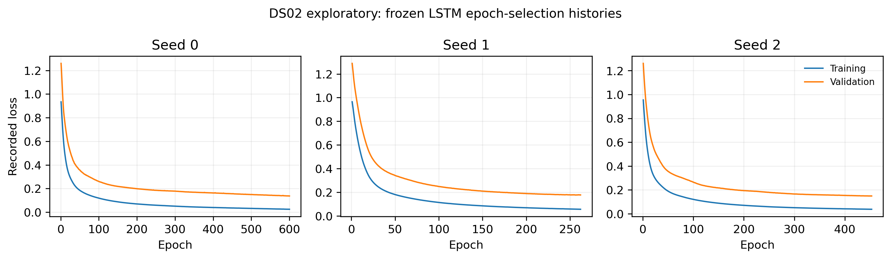
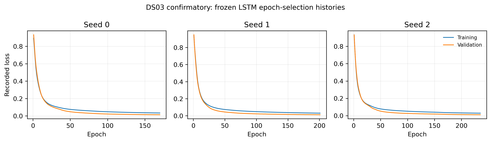

# Frozen supplementary material

All tables reproduce executed CSV fields verbatim; filtering to the frozen nominal 1% target does not constitute a new analysis. The copied CSV files are byte-identical to their named sources. DS02 correction and alternative-rule checks are exploratory only. DS03 uses the frozen primary phase rule. Fractions are not percentages unless a heading explicitly says so. No supplementary display is a new inferential endpoint.

## Table S1. DS02 correction sensitivity (exploratory)

Source: `results/phase3_dynamic_correction/correction_comparison.csv`, primary phase-rule rows. Nominal 1% calibration. Static, static-plus-derivative, and finite-history values are executed exploratory comparisons; no DS03 correction-variant confirmation is implied.

| correction | overall_fpr | climb_fpr | cruise_fpr | descent_fpr | worst_offdiagonal_transfer_fpr |
| --- | --- | --- | --- | --- | --- |
| static | 0.012770339380254113 | 0.0014645883460613035 | 0.0058311896549735264 | 0.03000820536865549 | 0.14306301585222062 |
| static_derivative | 0.012391685310761857 | 0.0006102451441922097 | 0.0045738213614184035 | 0.031056286070869563 | 0.1586463210298772 |
| history | 0.013626928769166477 | 0.001246643651706943 | 0.0042796663936600955 | 0.03459355844084205 | 0.15555034579767904 |

## Table S2. DS02 alternative phase-rule sensitivity (exploratory)

Source: `results/final_validation/canonical_results.csv`; pooled rows, alternative-rate rule, nominal 1% target. The DS03 confirmation did not use the alternative rule.

| detector | seed | climb_fpr | cruise_fpr | descent_fpr | descent_minus_climb | descent_minus_cruise |
| --- | --- | --- | --- | --- | --- | --- |
| pca | -1 | 0.0013059686725817813 | 0.0026953323186199897 | 0.035629485545643574 | 0.034323516873061795 | 0.03293415322702359 |
| isolation_forest | 0 | 0.002762321616551768 | 0.0037924911212582446 | 0.025145885035884365 | 0.0223835634193326 | 0.02135339391462612 |
| isolation_forest | 1 | 0.0024694680354273683 | 0.0038685946220192793 | 0.027869072372392514 | 0.025399604336965146 | 0.024000477750373235 |
| isolation_forest | 2 | 0.00258819246020753 | 0.003963723997970573 | 0.0262928432490442 | 0.02370465078883667 | 0.02232911925107363 |
| lstm_autoencoder | 0 | 0.004511528141646154 | 0.005162354134956875 | 0.022637333154470453 | 0.0181258050128243 | 0.01747497901951358 |
| lstm_autoencoder | 1 | 0.004590677758166262 | 0.0052447995941146625 | 0.02316050707626266 | 0.0185698293180964 | 0.017915707482147998 |
| lstm_autoencoder | 2 | 0.005295109345195222 | 0.005403348554033485 | 0.022704406734187405 | 0.017409297388992183 | 0.01730105818015392 |

## Table S3. DS02 per-engine primary results (exploratory)

Source: `results/final_validation/per_engine_phase_fpr.csv`; primary rule, nominal 1% target. Engine rows must not be read as independent timestamps.

| detector | seed | evaluation_unit | climb_fpr | cruise_fpr | descent_fpr | descent_minus_climb | descent_minus_cruise |
| --- | --- | --- | --- | --- | --- | --- | --- |
| pca | -1 | engine_11 | 0.0009687395208465294 | 0.004056162246489859 | 0.027800199745529667 | 0.026831460224683138 | 0.02374403749903981 |
| pca | -1 | engine_14 | 0.0029409361980230375 | 0.004913563232165863 | 0.04971857410881801 | 0.04677763791079497 | 0.044805010876652146 |
| pca | -1 | engine_15 | 0.0011273032855766668 | 0.004245688848988142 | 0.036657539086653125 | 0.035530235801076455 | 0.032411850237664984 |
| isolation_forest | 0 | engine_11 | 0.0009128507023361527 | 0.0037094817126018375 | 0.022341400681323793 | 0.02142854997898764 | 0.018631918968721954 |
| isolation_forest | 0 | engine_14 | 0.0148680663344498 | 0.013512298888456122 | 0.025103189493433396 | 0.010235123158983596 | 0.011590890604977274 |
| isolation_forest | 0 | engine_15 | 0.001967656643915637 | 0.003927729772191673 | 0.023959897535553398 | 0.02199224089163776 | 0.020032167763361725 |
| isolation_forest | 1 | engine_11 | 0.0008197026714855248 | 0.003039232680418328 | 0.023476940336283912 | 0.022657237664798387 | 0.020437707655865583 |
| isolation_forest | 1 | engine_14 | 0.012907442202434442 | 0.013931749408275159 | 0.03287054409005628 | 0.01996310188762184 | 0.018938794681781126 |
| isolation_forest | 1 | engine_15 | 0.001803685256922667 | 0.0035162533198668314 | 0.028243971380620087 | 0.02644028612369742 | 0.024727718060753256 |
| isolation_forest | 2 | engine_11 | 0.0007824434591452736 | 0.003732593748194372 | 0.02298441711244579 | 0.022201973653300514 | 0.019251823364251415 |
| isolation_forest | 2 | engine_14 | 0.013887754268442121 | 0.014321239176678551 | 0.02724202626641651 | 0.013354271997974388 | 0.012920787089737958 |
| isolation_forest | 2 | engine_15 | 0.001906167373793273 | 0.0038342123966633 | 0.025505697376556842 | 0.023599530002763568 | 0.021671484979893543 |
| lstm_autoencoder | 0 | engine_11 | 0.0022728119527553187 | 0.005581556595597157 | 0.023641114744229953 | 0.021368302791474635 | 0.018059558148632797 |
| lstm_autoencoder | 0 | engine_14 | 0.018871007270647822 | 0.012823201605896275 | 0.02071294559099437 | 0.0018419383203465492 | 0.007889743985098096 |
| lstm_autoencoder | 0 | engine_15 | 0.003402406280104122 | 0.00589159465828751 | 0.016208815475664693 | 0.01280640919556057 | 0.010317220817377184 |
| lstm_autoencoder | 1 | engine_11 | 0.002459108014456574 | 0.00614780146761426 | 0.025228134021041685 | 0.022769026006585112 | 0.019080332553427424 |
| lstm_autoencoder | 1 | engine_14 | 0.019933012008822807 | 0.012643437097402403 | 0.018348968105065665 | -0.0015840439037571423 | 0.005705531007663262 |
| lstm_autoencoder | 1 | engine_15 | 0.0034433991268523643 | 0.0058541877080761605 | 0.015811324087978095 | 0.01236792496112573 | 0.009957136379901935 |
| lstm_autoencoder | 2 | engine_11 | 0.0024777376206267 | 0.005916681111688912 | 0.023777926750851656 | 0.021300189130224956 | 0.017861245639162745 |
| lstm_autoencoder | 2 | engine_14 | 0.022955640879013153 | 0.013841867154028223 | 0.01774859287054409 | -0.005207048008469065 | 0.0039067257165158655 |
| lstm_autoencoder | 2 | engine_15 | 0.004181270368320728 | 0.006116036359555606 | 0.017136295380266762 | 0.012955025011946033 | 0.011020259020711156 |

## Table S4. DS03 per-engine primary results (confirmatory)

Source: `results/confirmation_ds03/canonical_results.csv`; engine rows, primary rule, nominal 1% target. Directional exceptions remain visible rather than being removed.

| detector | seed | evaluation_unit | climb_fpr | cruise_fpr | descent_fpr | descent_minus_climb | descent_minus_cruise |
| --- | --- | --- | --- | --- | --- | --- | --- |
| pca | -1 | engine_10 | 0.012580685592529924 | 0.012470976350322018 | 0.02448287629762547 | 0.011902190705095546 | 0.012011899947303452 |
| pca | -1 | engine_11 | 0.0038280376187400556 | 0.008784773060029283 | 0.021725567541458702 | 0.017897529922718647 | 0.01294079448142942 |
| pca | -1 | engine_12 | 0.003218793234887201 | 0.010387710314557425 | 0.010612652054642688 | 0.007393858819755487 | 0.00022494174008526324 |
| pca | -1 | engine_13 | 0.011202615962213879 | 0.007437232955315036 | 0.02248955978698134 | 0.011286943824767462 | 0.015052326831666305 |
| pca | -1 | engine_14 | 0.007440520836458552 | 0.0058742752517546536 | 0.014305453954320084 | 0.006864933117861532 | 0.00843117870256543 |
| pca | -1 | engine_15 | 0.01111593438963133 | 0.008455660730868864 | 0.021526870146844006 | 0.010410935757212676 | 0.013071209415975142 |
| isolation_forest | 0 | engine_10 | 0.0037444381776023062 | 0.011966674021075634 | 0.03113200277413886 | 0.027387564596536552 | 0.019165328753063225 |
| isolation_forest | 0 | engine_11 | 0.002882843144977079 | 0.011580852448348788 | 0.022812349058122686 | 0.019929505913145608 | 0.011231496609773899 |
| isolation_forest | 0 | engine_12 | 0.008470508512861056 | 0.006165743546870102 | 0.018454376679874755 | 0.0099838681670137 | 0.012288633133004653 |
| isolation_forest | 0 | engine_13 | 0.004526462395543176 | 0.012744265080713678 | 0.026646488640281983 | 0.022120026244738807 | 0.013902223559568305 |
| isolation_forest | 0 | engine_14 | 0.002880201614112988 | 0.010947512969179127 | 0.012815302500745076 | 0.009935100886632088 | 0.0018677895315659492 |
| isolation_forest | 0 | engine_15 | 0.003782828439428235 | 0.009710161455872529 | 0.01494799503564015 | 0.011165166596211914 | 0.00523783357976762 |
| isolation_forest | 1 | engine_10 | 0.0033527605439618974 | 0.011714522856452443 | 0.031550325300806925 | 0.02819756475684503 | 0.019835802444354483 |
| isolation_forest | 1 | engine_11 | 0.0030718820397296746 | 0.01117414999186595 | 0.023184672355498308 | 0.020112790315768632 | 0.012010522363632358 |
| isolation_forest | 1 | engine_12 | 0.008385803427732446 | 0.005496917128226565 | 0.016958075867993017 | 0.008572272440260572 | 0.011461158739766452 |
| isolation_forest | 1 | engine_13 | 0.004193411650720601 | 0.013778582246684644 | 0.026043063484157695 | 0.021849651833437095 | 0.01226448123747305 |
| isolation_forest | 1 | engine_14 | 0.0027601932135249466 | 0.009097497711321331 | 0.011054214419247338 | 0.008294021205722391 | 0.0019567167079260067 |
| isolation_forest | 1 | engine_15 | 0.0035502775107748596 | 0.009009596115935417 | 0.015156673878900372 | 0.011606396368125512 | 0.006147077762964954 |
| isolation_forest | 2 | engine_10 | 0.003885442125712853 | 0.013143379455983862 | 0.032320919428879664 | 0.028435477303166812 | 0.019177539972895803 |
| isolation_forest | 2 | engine_11 | 0.0029616093511239936 | 0.012129900764600618 | 0.02290291418451135 | 0.019941304833387356 | 0.010773013419910733 |
| isolation_forest | 2 | engine_12 | 0.008075218115594206 | 0.0057268262096352805 | 0.01688880268225775 | 0.008813584566663545 | 0.011161976472622471 |
| isolation_forest | 2 | engine_13 | 0.00449618505510476 | 0.014283427530075235 | 0.026186736140377764 | 0.021690551085273003 | 0.011903308610302529 |
| isolation_forest | 2 | engine_14 | 0.002580180612642885 | 0.010890296002441258 | 0.01169091549486575 | 0.009110734882222866 | 0.0008006194924244925 |
| isolation_forest | 2 | engine_15 | 0.0037208148584540013 | 0.009807914759119568 | 0.014464738767037529 | 0.010743923908583527 | 0.00465682400791796 |
| lstm_autoencoder | 0 | engine_10 | 0.007034530300181739 | 0.02519410386526723 | 0.03695549268486003 | 0.02992096238467829 | 0.011761388819592801 |
| lstm_autoencoder | 0 | engine_11 | 0.005450621465366499 | 0.019562388156824467 | 0.026706649492835292 | 0.021256028027468794 | 0.007144261336010826 |
| lstm_autoencoder | 0 | engine_12 | 0.011406951463986221 | 0.005852231163130944 | 0.012372190972318436 | 0.0009652395083322145 | 0.006519959809187492 |
| lstm_autoencoder | 0 | engine_13 | 0.00912861814218239 | 0.023973994311255586 | 0.026895521244396765 | 0.017766903102214376 | 0.0029215269331411796 |
| lstm_autoencoder | 0 | engine_14 | 0.0069304851339593776 | 0.00904028074458346 | 0.009916280581971876 | 0.002985795448012499 | 0.0008759998373884161 |
| lstm_autoencoder | 0 | engine_15 | 0.0069300176738705775 | 0.01322928037276593 | 0.015563048468407122 | 0.008633030794536544 | 0.002333768095641191 |
| lstm_autoencoder | 1 | engine_10 | 0.007050197405527355 | 0.02792574148201847 | 0.03905811380574423 | 0.03200791640021687 | 0.011132372323725756 |
| lstm_autoencoder | 1 | engine_11 | 0.005041037193402542 | 0.020406295754026353 | 0.02619344710996619 | 0.02115240991656365 | 0.005787151355939837 |
| lstm_autoencoder | 1 | engine_12 | 0.010926955981590762 | 0.006144842721287491 | 0.012095098229377373 | 0.0011681422477866112 | 0.0059502555080898824 |
| lstm_autoencoder | 1 | engine_13 | 0.008417100641879617 | 0.024121753906394296 | 0.026665644994444657 | 0.018248544352565038 | 0.0025438910880503617 |
| lstm_autoencoder | 1 | engine_14 | 0.006810476733371336 | 0.008487183399450718 | 0.00918475168658051 | 0.002374274953209173 | 0.0006975682871297913 |
| lstm_autoencoder | 1 | engine_15 | 0.0063408886546153604 | 0.014451196663353916 | 0.014486704961064922 | 0.00814581630644956 | 3.550829771100522e-05 |
| lstm_autoencoder | 2 | engine_10 | 0.007128532932255437 | 0.029344091783023923 | 0.04083048030031154 | 0.0337019473680561 | 0.01148638851728762 |
| lstm_autoencoder | 2 | engine_11 | 0.005497881189054648 | 0.021412884333821377 | 0.026515456448237 | 0.021017575259182353 | 0.0051025721144156225 |
| lstm_autoencoder | 2 | engine_12 | 0.010362255414066691 | 0.00486989236074825 | 0.00950428108287844 | -0.0008579743311882514 | 0.00463438872213019 |
| lstm_autoencoder | 2 | engine_13 | 0.009507084897662589 | 0.028098949675544556 | 0.027048772077698173 | 0.017541687180035584 | -0.0010501775978463829 |
| lstm_autoencoder | 2 | engine_14 | 0.006510455731901233 | 0.007457277998169057 | 0.007843615378363 | 0.0013331596464617674 | 0.00038633738019394365 |
| lstm_autoencoder | 2 | engine_15 | 0.00792223496945831 | 0.013783215757832484 | 0.013443310744763808 | 0.005521075775305497 | -0.00033990501306867607 |

## Table S5. DS02 individual-seed pooled results (exploratory)

Source: `results/final_validation/canonical_results.csv`; primary rule, nominal 1% target. No seed-mean interval is assigned to an individual seed.

| detector | seed | climb_fpr | cruise_fpr | descent_fpr | descent_minus_climb | descent_minus_cruise |
| --- | --- | --- | --- | --- | --- | --- |
| isolation_forest | 0 | 0.0028507166021550373 | 0.005663925065463899 | 0.02335427196315169 | 0.020503555360996652 | 0.01769034689768779 |
| isolation_forest | 1 | 0.0025281584545105832 | 0.005283253930717853 | 0.026691581567570177 | 0.024163423113059593 | 0.021408327636852326 |
| isolation_forest | 2 | 0.0026589252711231998 | 0.00580235093264428 | 0.02455404855647569 | 0.02189512328535249 | 0.01875169762383141 |
| lstm_autoencoder | 0 | 0.004524531854796527 | 0.007071254715131101 | 0.020782337082060582 | 0.016257805227264055 | 0.013711082366929481 |
| lstm_autoencoder | 1 | 0.004742476549150888 | 0.007307732238230918 | 0.021023671454280926 | 0.01628119490513004 | 0.013715939216050008 |
| lstm_autoencoder | 2 | 0.005387592844439795 | 0.0075038355500697896 | 0.02059616485206203 | 0.015208572007622233 | 0.01309232930199224 |

## Table S6. DS03 individual-seed pooled results (confirmatory)

Source: `results/confirmation_ds03/canonical_results.csv`; primary rule, nominal 1% target. Byte-identical individual-run intervals are in `table_s6ci_confirmation_ds03_hierarchical_bootstrap_ci.csv`; these are not seed-mean intervals. The corresponding DS02 intervals are in `table_s5ci_final_validation_hierarchical_bootstrap_ci.csv`.

| detector | seed | climb_fpr | cruise_fpr | descent_fpr | descent_minus_climb | descent_minus_cruise |
| --- | --- | --- | --- | --- | --- | --- |
| isolation_forest | 0 | 0.0041670111110090535 | 0.010948620767090893 | 0.021660296728761023 | 0.01749328561775197 | 0.01071167596167013 |
| isolation_forest | 1 | 0.00399249264419971 | 0.010600318055370966 | 0.02127095308315026 | 0.01727846043895055 | 0.010670635027779294 |
| isolation_forest | 2 | 0.004118023471202922 | 0.011574190769061554 | 0.02133866502151735 | 0.017220641550314428 | 0.009764474252455796 |
| lstm_autoencoder | 0 | 0.00759308416995037 | 0.017953629910037076 | 0.02230920280477896 | 0.01471611863482859 | 0.004355572894741883 |
| lstm_autoencoder | 1 | 0.0071919978690376685 | 0.018904587971640827 | 0.0222038731228746 | 0.01501187525383693 | 0.003299285151233771 |
| lstm_autoencoder | 2 | 0.00773698536188088 | 0.019823465520323005 | 0.021925501820698787 | 0.014188516458817906 | 0.0021020363003757814 |

## Table S7. Flight-level alarm burden (secondary descriptive)

Sources: DS02 and DS03 canonical CSVs; pooled primary-rule rows at nominal 1%. Fractions and events per healthy flight depend on phase duration and exposure. They are not the primary row-level FPR endpoint.

| dataset | detector | seed | healthy_flights_with_alarm_climb | healthy_flights_with_alarm_cruise | healthy_flights_with_alarm_descent | false_alarm_events_per_healthy_flight_climb | false_alarm_events_per_healthy_flight_cruise | false_alarm_events_per_healthy_flight_descent |
| --- | --- | --- | --- | --- | --- | --- | --- | --- |
| DS02 | pca | -1 | 0.13157894736842105 | 0.5 | 0.9868421052631579 | 0.3157894736842105 | 4.434210526315789 | 16.026315789473685 |
| DS02 | isolation_forest | 0 | 0.6842105263157895 | 0.4473684210526316 | 0.868421052631579 | 1.0263157894736843 | 3.0657894736842106 | 9.078947368421053 |
| DS02 | isolation_forest | 1 | 0.6052631578947368 | 0.4473684210526316 | 0.8552631578947368 | 0.881578947368421 | 2.763157894736842 | 8.355263157894736 |
| DS02 | isolation_forest | 2 | 0.6710526315789473 | 0.4605263157894737 | 0.868421052631579 | 0.9736842105263158 | 3.0657894736842106 | 9.605263157894736 |
| DS02 | lstm_autoencoder | 0 | 0.9736842105263158 | 0.7763157894736842 | 1.0 | 1.763157894736842 | 4.657894736842105 | 8.618421052631579 |
| DS02 | lstm_autoencoder | 1 | 0.9210526315789473 | 0.6447368421052632 | 1.0 | 1.4473684210526316 | 4.118421052631579 | 9.68421052631579 |
| DS02 | lstm_autoencoder | 2 | 0.9868421052631579 | 0.6842105263157895 | 1.0 | 1.75 | 4.4868421052631575 | 8.855263157894736 |
| DS03 | pca | -1 | 0.6756756756756757 | 0.7364864864864865 | 0.9932432432432432 | 4.5675675675675675 | 10.39864864864865 | 30.66216216216216 |
| DS03 | isolation_forest | 0 | 0.8108108108108109 | 0.6756756756756757 | 0.9932432432432432 | 2.9324324324324325 | 6.756756756756757 | 22.9527027027027 |
| DS03 | isolation_forest | 1 | 0.8108108108108109 | 0.6554054054054054 | 0.9932432432432432 | 2.5945945945945947 | 6.4391891891891895 | 20.986486486486488 |
| DS03 | isolation_forest | 2 | 0.777027027027027 | 0.6621621621621622 | 0.9932432432432432 | 2.810810810810811 | 7.074324324324325 | 21.385135135135137 |
| DS03 | lstm_autoencoder | 0 | 1.0 | 0.9527027027027027 | 1.0 | 5.95945945945946 | 13.472972972972974 | 26.52027027027027 |
| DS03 | lstm_autoencoder | 1 | 1.0 | 0.9256756756756757 | 1.0 | 5.6824324324324325 | 13.283783783783784 | 23.972972972972972 |
| DS03 | lstm_autoencoder | 2 | 1.0 | 0.9459459459459459 | 0.9932432432432432 | 5.391891891891892 | 13.121621621621621 | 23.385135135135137 |

## Table S8 and Figures S1–S2. LSTM convergence histories (descriptive)

The byte-identical executed histories are packaged as `table_s8a_final_validation_lstm_training_history.csv` and `table_s8b_confirmation_ds03_lstm_training_history.csv`. Figures S1–S2 plot the recorded training and epoch-selection validation losses without smoothing. DS02 seed 0 reached the pre-specified 600-epoch ceiling while validation loss was still improving; it is not described as converged. The copied `ds02_seed0_last100_loss_executed.md` provides the prior slope audit. These training diagnostics do not inspect downstream test results.

## Table S9. Chunk, tail, and sequence-boundary audit (diagnostic)

The byte-identical `table_s9_final_validation_lstm_boundary_audit.csv` contains the executed DS02 boundary categories and false-alarm diagnostics. It is not a frozen DS03 primary endpoint. Source: `results/final_validation/lstm_boundary_audit.csv`.

## Provenance

The companion `source_manifest.json` records SHA-256 digests of each copied executed CSV. Core claim interpretation remains governed by `paper/evidence_ledger.csv`, `paper/claim_audit.md`, and `docs/AUTHORITATIVE_RESULTS.md`; obsolete Phase 3 narratives are excluded.
